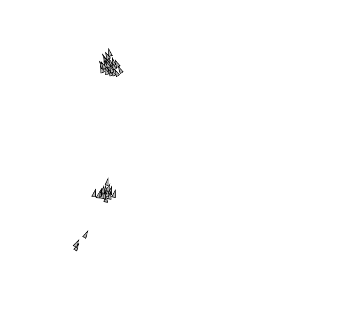

# boids
I translated Shiffman's Boids exploration from Nature of Code into the Python mode of Processing. 
 
You drag your mouse around the display window to create new boids, then they fly around in a flock.
 

